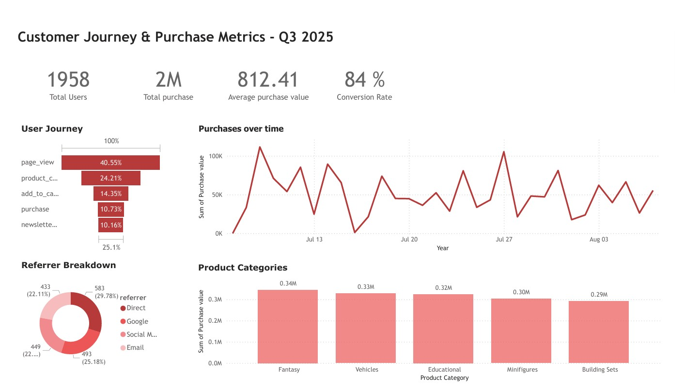
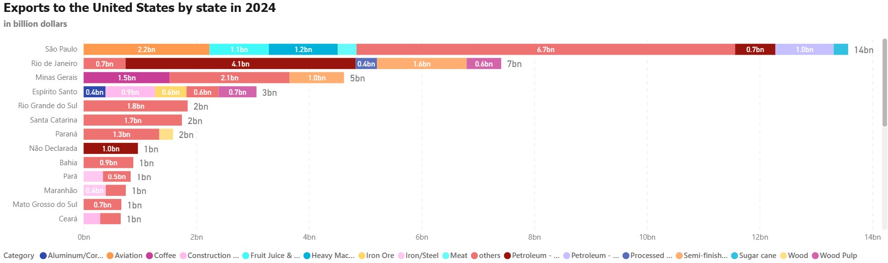

# Portfolio

Welcome to my portfolio! I am a MSc Software Design student with a focus on data analytics, automation, and machine learning. With a background in architectural engineering, I bring a unique cross-disciplinary approach to solving complex business problems through data-driven insights. I’m passionate about digital analytics, data engineering, and using technology to uncover what is behind the data.

---

## Technical Skills

- **Languages:** Python, Java, SQL, C#, LaTeX  
- **Python Libraries:** pandas, numpy, matplotlib, seaborn  
- **Data & Analytics Tools:** Power BI, Power Automate (learning), Excel, DBeaver  
- **Development Tools:** Git, GitHub, VS Code  
- **Concepts:** Data Cleaning, Data Visualization, Relational Databases, Data Mining, Big Data Systems, Agile Framework (SCRUM)

---

## Education

- **M.S., Software Design** – IT University of Copenhagen (_August 2024 - August 2027_)  
  Focus: Data Analytics, AI, Big Data Systems, Machine Learning

- **B.S., Engineering** – University of São Paulo (_January 2016 - December 2021_)

<!--
## Work Experience

**Teaching Assistant – BootIT & BootMath, IT University of Copenhagen**  
_August 2025 – Present_  
- Prepared course materials and supported students in foundational Java, SQL, and mathematics concepts.  
- Provided hands-on guidance to build technical confidence and understanding.

**Teaching Assistant – Software Engineering, IT University of Copenhagen**  
_August 2025 – Present_  
- Assisted students with object-oriented design, software architecture, and Java programming fundamentals.

**Automation Designer – Archiologics**  
_January 2025 – August 2025_  
- Identified and corrected a critical step in a production data pipeline affecting over 70% of active accounts.  
- Redeveloped loan origination models, improving performance by 50% and mitigating potential losses exceeding $1M.

**Environmental Design Analyst – BIG (Bjarke Ingels Group), Copenhagen**  
_January 2019 – July 2024_  
- Conducted environmental analyses (sun, wind, radiation) to guide sustainable, data-driven architectural design decisions.  
- Developed Python automation tools and parametric workflows for data simulation and analysis.  
- Collaborated cross-functionally to integrate environmental insights into design development. -->

---
## Digital Touchpoint Analytics for a Toy Retailer
This project recreates a digital analytics environment for a fictional toy retailer, showcasing my ability to simulate user behavior tracking, build clean data pipelines, and deliver actionable insights through tailored dashboards and communication assets.
- Designed and implemented simulated tracking variables to analyze customer journeys, engagement patterns, and conversion metrics.
- Focused on transforming behavioral data into clear, business-relevant insights to support decision-making.

Tools Used:
Power BI, SQL, Python, Pandas, NumPy

Customer Journey & Purchase Metrics - Q3 2025

[View the Power BI Dashboard](Images/dataanalytics.pdf)

[View the GitHub Repository](https://github.itu.dk/amli/Enhancing-LEGO-s-Digital-Play-Experience)

_Last updated: August 7, 2025 — content subject to change as the project develops._

---

## Brazil to US Export Analysis 2024 — Power BI 
A data-driven analysis of Brazil's 2024 exports to the U.S., visualized using Power BI, in light of new tariffs announced by U.S. President Donald Trump, set to take effect in August 2025. These tariffs, targeting Brazilian goods, could affect a trade flow worth nearly $40 billion.

Key findings show that nearly half of exports come from São Paulo and Rio de Janeiro—driven by Embraer aircraft and crude oil, respectively. While the U.S. plans a 50% tariff on many imports, almost half of Brazilian exports—including aircraft, oil, and orange juice—will remain at a 10% rate. However, coffee and meat will face steeper increases.

[View the Power BI Dashboard (PDF)](Images/ExportsUS2024BI.pdf)

---

## Data Science & Machine Learning Projects

- [**Image Recognition with CNN (LeNet)**](https://github.com/yourusername/image-recognition-cnn)  
  Developed a convolutional neural network using the Fashion MNIST dataset, achieving 82% accuracy in clothing image classification..

- [**Digits Recognition (Fully Connected NN)**](https://github.com/yourusername/digits-recognition-fc)  
  Developed a fully connected neural network for handwritten digit classification using MNIST.

- [**USA Housing Price Prediction**](https://github.com/yourusername/housing-price-prediction)  
  Created a linear regression model to predict U.S. housing prices based on demographic data.

- [**Heart Attack Prediction**](https://github.com/yourusername/heart-attack-prediction)  
  Performed comparative analysis with logistic regression and decision tree classifiers.

---

## Algorithms & Logic-Based AI Projects

- [**Othello AI with Alpha-Beta MinMax**](https://github.itu.dk/amli/OthelloProject)  
  Designed a strategic AI player for Othello using alpha-beta pruning optimization.

- [**Sudoku Solver**](https://github.itu.dk/amli/sudoku_AI)  
  Implemented constraint satisfaction techniques including forward checking and arc consistency.

---

## Software Engineering Projects

- [**Search Engine in Java**](https://github.com/yourusername/java-search-engine)  
  Developed a search engine featuring indexing, ranking algorithms, and query processing.

---

## Contact

- [LinkedIn](https://www.linkedin.com/in/amanda-cunha-213a1b1b5/)  
- [Email](amli@itu.dk)  
- [GitHub](https://github.itu.dk/amli)

---

Thank you for visiting my portfolio. Feel free to explore my projects and reach out if you'd like to connect!
